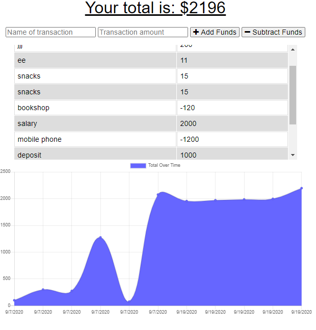

# PWA: Online/Offline Budget Trackers


## Budget Trackers

## Live URL
https://serene-tundra-94628.herokuapp.com/

## Description
To add functionality to our existing Budget Tracker application to allow for offline access and functionality.
The user will be able to add expenses and deposits to their budget with or without a connection. When entering transactions offline, they should populate the total when brought back online.
## Table of Contents
* [License](#license)
* [Installation](#installation)
* [Tests](#tests)
* [Usage](#usage)
* [Credits](#contribution)
* [Questions](#questions)

## Installation
``` Install Node.js first, and then run npm install , Install Heroku```
## Tests
``` Terminal Tab 1: mongod  ```
``` Terminal Tab 2: npm install, npm run seed, npm start ```
## Usage
AS AN avid traveller
I WANT to be able to track my withdrawals and deposits with or without a data/internet connection
SO THAT my account balance is accurate when I am traveling
## License
MIT
## Credits
* PWA
* Node JS
* Express Framework
* MongoDB
* manifest
## Questions
GitHub: https://github.com/miao0007

Email: miao188@hotmail.com

## Deployed Site Preview

### Web Page



mongodb+srv://miao0007:@clustermiao.txmyc.mongodb.net/budget?retryWrites=true&w=majority